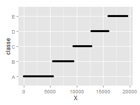

##Introduction

This report aims to take the Weight Lifting Exercise Dataset (see http://groupware.les.inf.puc-rio.br/har for more information) and build a model using machine learning methods to predict the manner in which people do the exercise. I first build a model from the training dataset and then estimate the out of sample error by applying it to the test dataset.

##Exploratory Analysis & Data Processing

Download data:


```r
download.file("https://d396qusza40orc.cloudfront.net/predmachlearn/pml-training.csv","pml-training.csv")
```

Load data:


```r
data<-read.csv("pml-training.csv")
```

Following tradition, partition the dataset into training and testing dataset where training dataset contains 60% of the observations.

```r
library(caret)
set.seed(123)
inTrain<-createDataPartition(data$classe,p = .6,list = FALSE)
training<-data[inTrain,]
testing<-data[-inTrain,]
rm(data,inTrain)
```

First go through the variable names by running `names(training)`. The response variable in the model to be built is called "classe" meaning the manner people do exercise. By common sense, one can claim "classe" should not be related to "X", the row number, and "user_name". Plot and make a table to verify:


```r
library(ggplot2)
qplot(x=X,,y=classe,data=training)
```

 

```r
table(training$user_name,training$classe)
```

```
##           
##              A   B   C   D   E
##   adelmo   703 477 432 298 428
##   carlitos 492 412 297 299 345
##   charles  534 456 325 415 424
##   eurico   531 367 288 341 324
##   jeremy   715 288 407 296 341
##   pedro    373 279 305 281 303
```

Although one can see "X" seems to be a greatly useful predictor, this clear relation may be caused by the particular way the data were recorded and it should not matter in prediction in general; it is good that the table looks quite random. Therefore, I exclude these two variables from dataset:


```r
training$X<-NULL
training$user_name<-NULL
```

By running `str(training)` and `summary(training)`, one can see some variables have many NAs or simply nothing for many observations. I consider the variables with more than 95% of missing values useless because typically these data are missing and cannot provide any information for prediction.


```r
logi<-sapply(training,function(x){
    if(class(x)=="factor" && "" %in% levels(x) && sum(x=="")/length(x)>.95)
        return(FALSE)
    else if(sum(is.na(x))/length(x)>.95)
        return(FALSE)
    TRUE
    })
training<-training[,logi]
```

##Model Building

It is hard to immediately see the relationship between "classe" and other crazy variables. Hence, I decide to use random forest to use random forest, boosting and linear discriminant analysis to build three models because they require less knowledge about the data, and then use random forest to combine their predictions to obtain the final prediction for smaller out of sample error. This method requires considerable computation, so I let the number of folds or iterations be 4 rather than the default 10 to speed up. This change will also introduce less bias to the model.


```r
set.seed(2014)
modelRF<-train(classe~.,data=training,method="rf",trControl = trainControl(number=4))
modelGBM<-train(classe~.,data=training,method="gbm",trControl = trainControl(number=4))
modelLDA<-train(classe~.,data=training,method="lda",trControl = trainControl(number=4))
predRF<-predict(modelRF,training)
predGBM<-predict(modelGBM,training)
predLDA<-predict(modelLDA,training)
training2<-data.frame(classe=training$classe,x1=predRF,x2=predGBM,x3=predLDA)
modelCOM<-train(classe~.,data=training2,method="rf",trControl = trainControl(number=4))
```

Check how this model works on the training dataset to get an optimistic estimate of error:


```r
confusionMatrix(predict(modelCOM,training2),training$classe)
```

```
## Confusion Matrix and Statistics
## 
##           Reference
## Prediction    A    B    C    D    E
##          A 3348    0    0    0    0
##          B    0 2279    0    0    0
##          C    0    0 2054    0    0
##          D    0    0    0 1930    0
##          E    0    0    0    0 2165
## 
## Overall Statistics
##                                      
##                Accuracy : 1          
##                  95% CI : (0.9997, 1)
##     No Information Rate : 0.2843     
##     P-Value [Acc > NIR] : < 2.2e-16  
##                                      
##                   Kappa : 1          
##  Mcnemar's Test P-Value : NA         
## 
## Statistics by Class:
## 
##                      Class: A Class: B Class: C Class: D Class: E
## Sensitivity            1.0000   1.0000   1.0000   1.0000   1.0000
## Specificity            1.0000   1.0000   1.0000   1.0000   1.0000
## Pos Pred Value         1.0000   1.0000   1.0000   1.0000   1.0000
## Neg Pred Value         1.0000   1.0000   1.0000   1.0000   1.0000
## Prevalence             0.2843   0.1935   0.1744   0.1639   0.1838
## Detection Rate         0.2843   0.1935   0.1744   0.1639   0.1838
## Detection Prevalence   0.2843   0.1935   0.1744   0.1639   0.1838
## Balanced Accuracy      1.0000   1.0000   1.0000   1.0000   1.0000
```

The optimistic error rate is 0.

##Estimate Out of Sample Error

Apply the model to the testing dataset and get the out of sample error:


```r
PredRF<-predict(modelRF,testing)
PredGBM<-predict(modelGBM,testing)
PredLDA<-predict(modelLDA,testing)
testing2<-data.frame(x1=PredRF,x2=PredGBM,x3=PredLDA)
sum(predict(modelCOM,testing2)!=testing$classe)/nrow(testing)
```

```
## [1] 0.0007647209
```

The expected out of sample error is only 0.0007647209, so this model works quite well.
